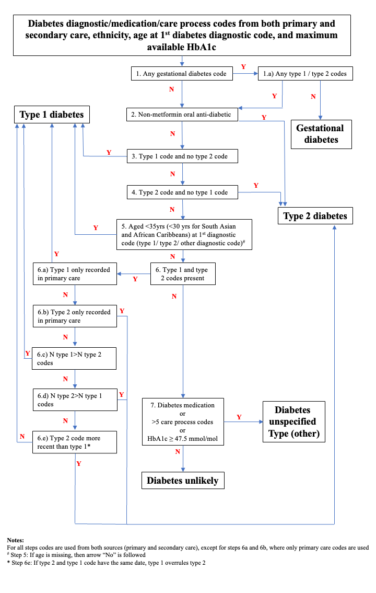

<!-- README.md is generated from README.Rmd. 
Please edit that file and rerun in R `rmarkdown::render('README.Rmd')` -->

# diabetes-algo

This is the code and configuration for `diabetes-algo`, which is an R
reusable action for the OpenSAFELY framework.

The action:

- Loads and double-checks 21 input variables
- Runs the diabetes adjudication algorithm (Figure 1 below) to define
  the following Diabetes types: Type 1, Type 2, Gestational, Other,
  Unlikely

## Usage

The input variables/arguments/options to the action are specified using
the flags style (i.e., `--argname=argvalue`). Below, you find a detailed
description of each input variable including examples for codelists to
use when defining these variables in the OpenSAFELY dataset definition.
An example of a dataset definition that defines each 21 input variables,
find
[here](https://github.com/alainamstutz/diabetes-algo/blob/main/analysis/dataset_definition.py).

    Usage: diabetes-algo:[version] [options]


    Options:
    --df_input=FILENAME.CSV
    Input dataset. csv file. Assumed to be within the directory 'output' [default
    input.csv]

    --remove_helper=TRUE/FALSE
    Logical, indicating whether all helper variables (_tmp and step_) are removed
    [default TRUE]

    --birth_date=YYYY-MM-DD
    Birth date [default birth_date]

    --ethnicity_cat=ETHNICITY_VARNAME
    Ethnicity, in 6 categories, coded as follows: White, Mixed, South Asian, Black,
    Other, Unknown. [default ethnicity_cat]

    --t1dm_date=YYYY-MM-DD
    First type 1 DM diagnosis date, from both primary (e.g.
    https://www.opencodelists.org/codelist/user/hjforbes/type-1-diabetes/674fbd7a/)
    and secondary (e.g.
    https://www.opencodelists.org/codelist/opensafely/type-1-diabetes-secondary-care/2020-09-27/)
    care [default t1dm_date]

    --tmp_t1dm_ctv3_date=YYYY-MM-DD
    First type 1 DM diagnosis date, from primary care only [default
    tmp_t1dm_ctv3_date]

    --tmp_t1dm_count_num=T1DM_COUNT_VARNAME
    Count of all recorded Type 1 DM diagnosis codes, from both primary and
    secondary care [default tmp_t1dm_count_num]

    --t2dm_date=YYYY-MM-DD
    First type 2 DM diagnosis date, from both primary (e.g.
    https://www.opencodelists.org/codelist/user/hjforbes/type-2-diabetes/3530d710/)
    and secondary (e.g.
    https://www.opencodelists.org/codelist/user/r_denholm/type-2-diabetes-secondary-care-bristol/0b7f6cd4/)
    care [default t2dm_date]

    --tmp_t2dm_ctv3_date=YYYY-MM-DD
    First type 2 DM diagnosis date, from primary care only [default
    tmp_t2dm_ctv3_date]

    --tmp_t2dm_count_num=T2DM_COUNT_VARNAME
    Count of all recorded Type 2 DM diagnosis codes, from both primary and
    secondary care [default tmp_t2dm_count_num]

    --otherdm_date=YYYY-MM-DD
    First other/unspecified DM diagnosis date, from primary care (e.g.
    https://www.opencodelists.org/codelist/user/hjforbes/other-or-nonspecific-diabetes/0311f0a6/)
    only [default otherdm_date]

    --tmp_otherdm_count_num=OTHERDM_COUNT_VARNAME
    Count of all recorded other/unspecified DM diagnosis codes, from primary care
    only [default tmp_otherdm_count_num]

    --gestationaldm_date=YYYY-MM-DD
    First gestational DM diagnosis date, from both primary (e.g.
    https://www.opencodelists.org/codelist/user/hjforbes/gestational-diabetes/1ed423d1/)
    and secondary (e.g.
    https://www.opencodelists.org/codelist/user/alainamstutz/gestational-diabetes-icd10-bristol/474e7a09/)
    care [default gestationaldm_date]

    --tmp_poccdm_date=YYYY-MM-DD
    First Non-diagnostic DM code date, from primary care (e.g.
    https://www.opencodelists.org/codelist/user/hjforbes/nondiagnostic-diabetes-codes/50f30a3b/)
    only [default tmp_poccdm_date]

    --tmp_poccdm_ctv3_count_num=NON_DIAG_DM_CODE_COUNT_VARNAME
    Count of all recorded Non-diagnostic DM codes, from primary care only [default
    tmp_poccdm_ctv3_count_num]

    --tmp_max_hba1c_mmol_mol_num=MAX_HBA1C_VARNAME
    Maximum HbA1c value recorded in query period, in mmol/mol (use
    https://www.opencodelists.org/codelist/opensafely/glycated-haemoglobin-hba1c-tests-numerical-value/5134e926/)
    from primary care only [default tmp_max_hba1c_mmol_mol_num]

    --tmp_max_hba1c_date=YYYY-MM-DD
    First maximum HbA1c value date, from primary care only [default
    tmp_max_hba1c_date]

    --tmp_insulin_dmd_date=YYYY-MM-DD
    First insulin drug date variable, from primary care (e.g.
    https://www.opencodelists.org/codelist/opensafely/insulin-medication/2020-04-26/)
    only [default tmp_insulin_dmd_date]

    --tmp_antidiabetic_drugs_dmd_date=YYYY-MM-DD
    First antidiabetic drug (any, except insulin) date, from primary care (e.g.
    https://www.opencodelists.org/codelist/opensafely/antidiabetic-drugs/2020-07-16/)
    only [default tmp_antidiabetic_drugs_dmd_date]

    --tmp_nonmetform_drugs_dmd_date=YYYY-MM-DD
    First antidiabetic drug (any, except insulin and metformin) date, from primary
    care (e.g.
    https://www.opencodelists.org/codelist/user/r_denholm/non-metformin-antidiabetic-drugs_bristol/7207eb58/)
    only [default tmp_nonmetform_drugs_dmd_date]

    --tmp_diabetes_medication_date=YYYY-MM-DD
    First antidiabetic drug date, i.e. minimum of tmp_insulin_dmd_date and
    tmp_antidiabetic_drugs_dmd_date [default tmp_diabetes_medication_date]

    --tmp_first_diabetes_diag_date=YYYY-MM-DD
    First diabetes diagnosis date variable, i.e. minimum of t1dm_date, t2dm_date,
    otherdm_date, gestationaldm_date, tmp_poccdm_date,
    tmp_nonmetform_drugs_dmd_date, and tmp_diabetes_medication_date [default
    tmp_first_diabetes_diag_date]

    --df_output=FILENAME.RDS
    Output dataset. rds file. This is assumed to be added to the directory 'output'
    [default data_processed.rds]

    -h, --help
    Show this help message and exit

## Diabetes Adjudication Algorithm Flowchart

<figure>

<figcaption aria-hidden="true">Figure 1</figcaption>
</figure>

This action can be specified in the `project.yaml` with its options at
their default values as follows, where you should replace `[version]`
with the latest tag from [here](xy), e.g., `v0.0.1`. Note that no space
is allowed between `diabetes-algo:` and `[version]`. This action can be
run specifying input arguments as follows (in YAML \> indicates to treat
the subsequent nested lines as a single line).

``` yaml
generate_dataset:
    run: ehrql:v1 generate-dataset analysis/dataset_definition.py --output output/input.csv
    outputs:
      highly_sensitive:
        dataset: output/input.csv

diabetes_algo:
  run: >
    diabetes-algo:[version]
      --birth_date=your_dob_date_variable
      --tmp_t1dm_ctv3_date=your_t2dm_from_primcare_date_variable
      --tmp_max_hba1c_mmol_mol_num=your_max_hba1c_num_variable
      --etc.
      --df_output=data_processed.rds
  needs:
  - generate_dataset
  outputs:
    highly_sensitive:
      rds: output/data_processed.rds
```

## Notes for developers

Please see [*DEVELOPERS.md*](DEVELOPERS.md).

For more information about reusable actions see
[here](https://docs.opensafely.org/actions-reusable/).

# About the OpenSAFELY framework

The OpenSAFELY framework is a Trusted Research Environment (TRE) for
electronic health records research in the NHS, with a focus on public
accountability and research quality.

Read more at [OpenSAFELY.org](https://opensafely.org).

# Licences

As standard, research projects have a MIT license.
